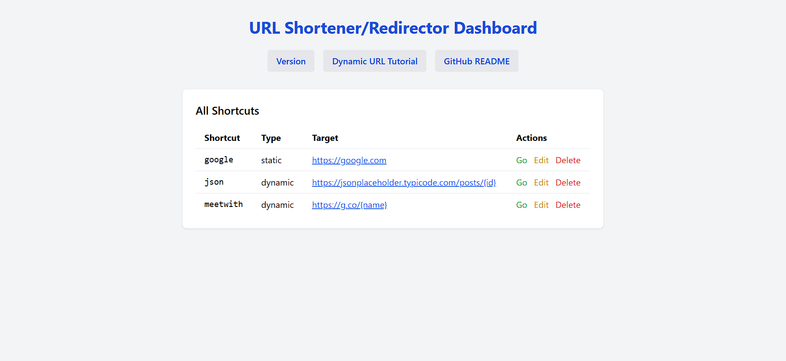
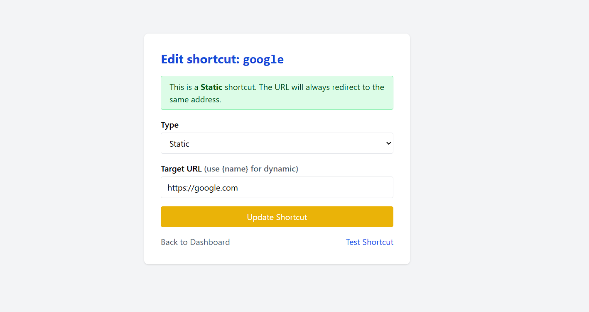
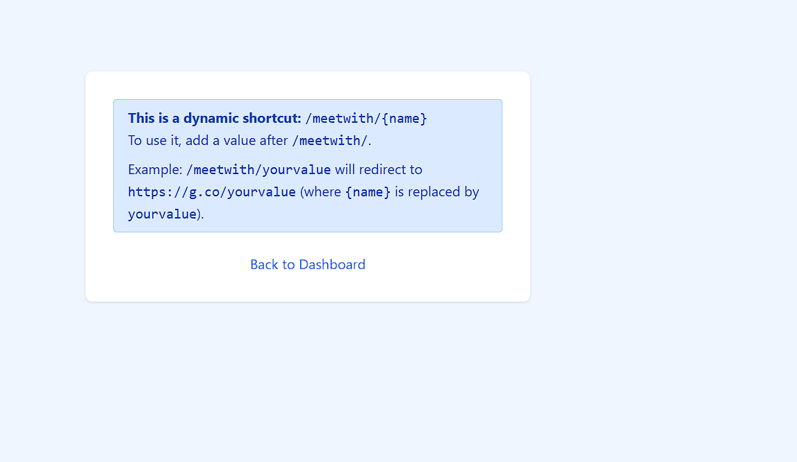
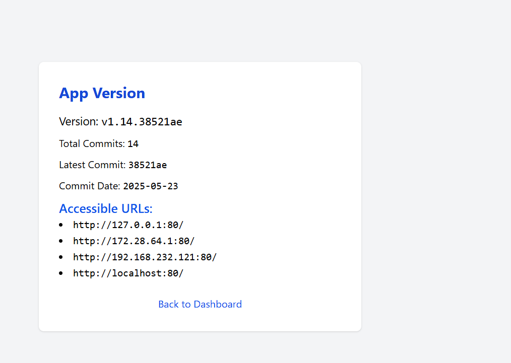

# URL Shortener & Redirector

A modern, cross-platform, self-hosted URL shortener and redirector with a beautiful web UI, dynamic shortcut support, and easy management. Built with Python Flask and SQLite, designed for personal and small team use.

---

## Company-Wide Usage

To use this URL shortener across your company or team:

1. **Deploy the app on a server or always-on workstation** accessible to everyone on your internal network.
2. **Set a static IP or hostname** for the machine running the app (e.g., `r.local` or `shortcuts.company.local`).
3. **Configure DNS or hosts file** for all users:
   - For small teams, add an entry to each user's `hosts` file:
     - **Windows:** `C:\Windows\System32\drivers\etc\hosts`
     - **macOS/Linux:** `/etc/hosts`
     - Example entry:
       ```
       192.168.1.100   r.local
       ```
     Replace `192.168.1.100` with your server's IP address.
   - For larger organizations, set up an internal DNS record for `r.local` or your chosen hostname.
4. **Share the base URL** (e.g., `http://r.local:5000/`) with your team. Users can now access shortcuts like `http://r.local:5000/google` from any device on the network.
5. **Manage shortcuts centrally:**
   - Use the dashboard to add, edit, or remove shortcuts for everyone.
   - Deletion can be protected by a password if configured.
6. **(Optional) Enable HTTPS:**
   - For extra security, consider running the app behind a reverse proxy (like Nginx) with HTTPS enabled.

---

## Features

- **Static & Dynamic Shortcuts**: Create simple or parameterized redirects (e.g., `/meetwith/raj` → `https://g.co/meet/raj`).
- **Visual Dashboard**: Manage all shortcuts in a clean, interactive web UI.
- **Real-Time Editing**: Edit shortcuts with instant feedback, type detection, and suggestions.
- **Dynamic Shortcut Help**: Users get clear guidance if they visit a dynamic shortcut without providing a variable.
- **Configurable Security**: Deletion can require a password (if set in config).
- **Cross-Platform Autostart**: Scripts for Windows, Linux, and macOS to run the app at login/boot.
- **Step-by-Step Tutorial**: In-app guide at `/tutorial`.
- **No Cloud Required**: All data stays on your machine.

---

## Quick Start (Native)

1. **Install Python 3** (if not already installed).
2. **Clone the repository** and install dependencies:
   ```pwsh
   git clone <repo-url>
   cd r
   pip install -r requirements.txt
   ```
3. **Run the app:**
   ```pwsh
   python app.py
   ```
   The server will be available at [http://localhost:5000/](http://localhost:5000/) (or your configured port).

---

## Quick Start (Docker)

You can use the prebuilt Docker image from Docker Hub: [`rajlabs/redirect`](https://hub.docker.com/r/rajlabs/redirect)

1. **Pull and run the image:**
   ```sh
   docker pull rajlabs/redirect:latest
   docker run -d -p 5000:5000 -v $(pwd)/redirects.db:/app/redirects.db --name url-shortener rajlabs/redirect:latest
   ```
   - The app will be available at [http://localhost:5000/](http://localhost:5000/)
   - The `redirects.db` file will persist on your host for data durability.

2. **(Optional) Build your own image:**
   If you want to build from source (for custom changes):
   ```sh
   docker build -t rajlabs/redirect .
   docker run -d -p 5000:5000 -v $(pwd)/redirects.db:/app/redirects.db --name url-shortener rajlabs/redirect
   ```

**For company-wide or local DNS:**
- Point your DNS or hosts file to the server running the Docker container, as described above.
- Use the server's IP or DNS name in the browser (e.g., `http://r.local:5000/shortcut`).

---

## Docker on Custom Port & Reverse Proxy Setup

By default, Docker containers expose the app on a specific port (e.g., 5000). To make your shortcuts accessible at a friendly address like `http://r/google` (without a port number), use a reverse proxy such as Nginx or Caddy on your host machine.

### 1. Run Docker on a Custom Port

You can map any host port to the container's port 5000. For example, to use port 3000:

```sh
# Map host port 3000 to container port 5000
# (You can change 3000 to any available port)
docker run -d -p 3000:5000 -v $(pwd)/redirects.db:/app/redirects.db --name url-shortener url-shortener
```

The app will be available at `http://localhost:3000/`.

### 2. Set Up a Reverse Proxy (Nginx Example)

To allow users to access the app at `http://r/shortcut` (no port), set up a reverse proxy on your server:

#### Example Nginx config:

```
server {
    listen 80;
    server_name r.local;  # Or your chosen DNS/hostname

    location / {
        proxy_pass http://localhost:3000;  # Or whatever port you mapped
        proxy_set_header Host $host;
        proxy_set_header X-Real-IP $remote_addr;
        proxy_set_header X-Forwarded-For $proxy_add_x_forwarded_for;
        proxy_set_header X-Forwarded-Proto $scheme;
    }
}
```

- Reload Nginx after saving the config: `sudo systemctl reload nginx`
- Make sure your DNS or hosts file points `r.local` to your server's IP.
- Now users can access shortcuts like `http://r/google` from any device on the network (no port needed).

#### (Optional) HTTPS
For security, you can add a free SSL certificate (e.g., with [Let's Encrypt](https://letsencrypt.org/)) to your Nginx config.

---

## Configuration & Settings

All configuration is managed via the database and environment variables. There is no admin UI.

- **Port**: Set by the `PORT` environment variable or defaults to 5000.
- **Redirect Delay**: Set in the database (`auto_redirect_delay` config key).
- **Admin Password**: Generated on first run and can be changed by updating the database directly.
- **Delete Requires Password**: Can be toggled by updating the database directly.

> **Tip:** Use a SQLite editor to update config values if needed.

---

## Dashboard Overview

The dashboard lists all your shortcuts, with options to edit, delete, or test each one. Navigation links to Version, Tutorial, and README are provided.



---

## Creating & Editing Shortcuts

- **To create or edit:** Go to `/edit/<shortcut>` (e.g., `/edit/meetwith`).
- The edit page provides real-time feedback:
  - **Type detection**: Instantly shows if your shortcut is static or dynamic (icon only).
  - **Auto-prefix**: Adds `https://` if you forget it.
  - **Dynamic variable help**: Shows the variable name if your target uses `{variable}`.



---

## Dynamic Shortcuts

- Use curly braces in the target URL (e.g., `https://g.co/meet/{name}`) to create a dynamic shortcut.
- Visiting `/meetwith/raj` will redirect to `https://g.co/meet/raj`.
- If a user visits a dynamic shortcut without providing a variable, a helpful message appears:



---

## Authentication & Security

- **Editing**: Anyone with access to the web UI can create or edit shortcuts.
- **Deleting**: If the "Delete Requires Password" option is enabled, deletion requires the admin password.
- **Configuration**: All settings (port, delay, password) are managed via the database or environment variables. There is no admin UI.
- **Admin Password**: The password is generated on first run and can be changed by updating the database directly.

---

## In-App Tutorial

For a step-by-step guide with screenshots, visit `/tutorial` in your running app.

---

## Version Info

Check the app version and update status from the dashboard:



---

## Autostart on Boot (Cross-Platform)

Scripts are provided to set up the app to run at login or system boot:

- **Windows**: `autostart-windows.ps1`
- **Linux**: `autostart-linux.sh`
- **macOS**: `autostart-macos.sh`

Each script:
- Checks/installs Python and Git
- Clones or updates the repo
- Installs requirements
- Sets up the app to run at login/reboot using the platform's native scheduler

See `autostart-scripts.md` for details.

---

## Custom Domain or Local DNS

To use a friendly shortcut like `r.local`:

- **Windows**: Edit `C:\Windows\System32\drivers\etc\hosts` and add:
  ```
  127.0.0.1   r.local
  ```
- **macOS/Linux**: Edit `/etc/hosts` and add the same line.
- Access via `http://r.local:5000/google`

---

## Troubleshooting

### Port Already in Use
If you see an error like `OSError: [Errno 98] Address already in use`, change the port using the `PORT` environment variable or update the value in the database, then restart the app.

### Permissions
- Ports below 1024 may require admin privileges. For development, use a higher port (e.g., 5000).

### Resetting Configuration
If you need to reset the admin password or other settings, you can do so by editing the database directly with a SQLite editor.

---

## Security Note
This app is intended for local/private network use. Do **not** expose it to the public internet without proper authentication.

---

## License
MIT
